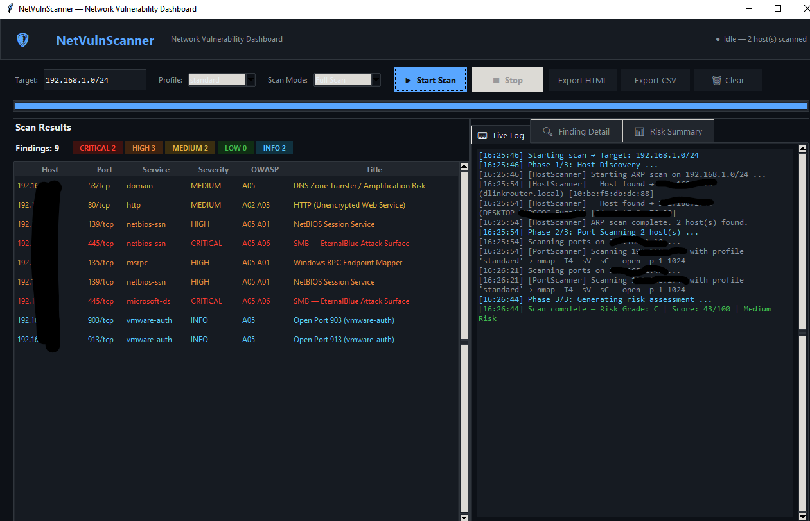

<div align="center">

# 🛡️ NetVulnScanner

**A Python-based Network Vulnerability Scanner with Real-Time GUI Dashboard**


*Detects open ports, active hosts, and potential vulnerabilities on a local network, 
mapped against OWASP Top 10 with automated risk reports and a live GUI dashboard.*

</div>

---

## 📸 Screenshot

> Real-time scan of a local network, 2 hosts discovered, 9 findings across CRITICAL/HIGH/MEDIUM severities, live log with Nmap output.




---

## ✨ Features

| Feature | Description |
|---|---|
| 🔍 **Host Discovery** | ARP scan via Scapy with ICMP ping fallback (no root needed) |
| 🔌 **Port Scanning** | 5 Nmap profiles — quick, standard, full, vuln, stealth |
| 🗺️ **OWASP Mapping** | Every open port mapped to OWASP Top 10 (2021) categories |
| ⚠️ **CVE References** | Critical CVEs linked per finding (EternalBlue, BlueKeep, Redis RCE, etc.) |
| 📊 **Risk Scoring** | Automated A–F risk grade with score/100 |
| 🖥️ **GUI Dashboard** | Dark-themed real-time Tkinter dashboard with live log and findings table |
| 📄 **Report Export** | Styled HTML + CSV reports with remediation steps |
| 🪟 **Cross-Platform** | Works on Windows, Linux, and macOS |

---

## 🏗️ Project Structure

```
network_scanner/
├── main.py                  ← Entry point
├── requirements.txt
├── setup.bat                ← Windows one-click setup
│
├── scanner/
│   ├── host_scanner.py      ← Scapy ARP discovery + Nmap port scanner
│   └── vuln_mapper.py       ← OWASP Top 10 mapper + risk scoring engine
│
├── reports/
│   └── generator.py         ← HTML & CSV report generator
│
├── gui/
│   └── dashboard.py         ← Tkinter real-time GUI dashboard
│
└── output_reports/          ← Scan reports saved here
```

---

## ⚙️ Installation

### Prerequisites

| Dependency | Download | Notes |
|---|---|---|
| Python 3.10+ | [python.org](https://python.org/downloads) | Tick **"Add to PATH"** on Windows |
| Nmap binary | [nmap.org/download](https://nmap.org/download.html) | Required for port scanning |
| Npcap *(Windows only)* | [npcap.com](https://npcap.com/#download) | Required for Scapy ARP scan on Windows |

### Windows (Quick Setup)

```cmd
:: Run CMD as Administrator, then:
cd path\to\network_scanner
setup.bat
```

`setup.bat` automatically installs all Python packages and checks for missing dependencies.

### Linux / macOS

```bash
sudo apt install nmap          # Linux
brew install nmap              # macOS

pip install -r requirements.txt
```

---

## 🚀 Usage

```bash
# Windows (as Administrator)
python main.py

# Linux/macOS (sudo for ARP scan)
sudo python main.py
```

### Scan Profiles

| Profile | Nmap Args | Best For |
|---|---|---|
| `quick` | `-T4 -F --open` | Fast recon, common ports |
| `standard` | `-T4 -sV -sC --open -p 1-1024` | Balanced — default |
| `full` | `-T4 -sV -sC --open -p 1-65535` | Complete audit |
| `vuln` | `-T4 -sV --script=vuln --open` | CVE detection via NSE scripts |
| `stealth` | `-sS -T2 -sV --open` | Low-noise SYN scan |

---

## 🗺️ OWASP Top 10 (2021) Mapping

| ID | Category | Example Findings |
|---|---|---|
| A01 | Broken Access Control | Redis, MongoDB, Elasticsearch unauth |
| A02 | Cryptographic Failures | HTTP (port 80), Telnet, FTP |
| A03 | Injection | MySQL, MSSQL, PostgreSQL exposed |
| A05 | Security Misconfiguration | SMB (445), RPC (135), DNS |
| A06 | Vulnerable & Outdated Components | RDP (CVE-2019-0708), SMB (CVE-2017-0144) |
| A07 | Auth Failures | SSH, VNC, RDP brute-force vectors |

### Notable CVEs Covered

- `CVE-2017-0144` — EternalBlue (SMB / WannaCry / NotPetya)
- `CVE-2019-0708` — BlueKeep (RDP Pre-Auth RCE)
- `CVE-2022-0543` — Redis Lua Sandbox Escape (RCE)
- `CVE-2014-3566` — POODLE (TLS downgrade)
- `CVE-2021-22145` — Elasticsearch data exposure
- `CVE-2017-15535` — MongoDB unauthenticated access

---

## 📊 Risk Scoring

| Grade | Score | Label |
|---|---|---|
| A | 0–9 | Minimal Risk |
| B | 10–29 | Low Risk |
| C | 30–49 | Medium Risk |
| D | 50–74 | High Risk |
| F | 75–100 | Critical Risk |

Severity weights: `CRITICAL=10` · `HIGH=5` · `MEDIUM=2` · `LOW=1` · `INFO=0`

---

## 🛠️ Tech Stack

- **Python 3.10+** — Core language
- **[Scapy](https://scapy.net/)** — ARP-based host discovery and packet crafting
- **[python-nmap](https://pypi.org/project/python-nmap/)** — Nmap wrapper for port and service scanning
- **Tkinter** — Cross-platform GUI dashboard
- **[OWASP Top 10 (2021)](https://owasp.org/Top10/)** — Vulnerability classification framework

---

## ⚠️ Legal Disclaimer

> This tool is intended for **authorized security testing and educational purposes only.**
>
> Only scan networks and systems that **you own** or have **explicit written permission** to test.
> Unauthorized network scanning may be **illegal** in your jurisdiction.
>
> The author assumes no liability for misuse of this tool.

---

## 👨‍💻 Author

**Faazil Mirza Shaikh**  
B.E. Computer Science — M.H. Saboo Siddik College of Engineering, Mumbai  
Specialization: Cybersecurity · IoT · Blockchain

*Built as part of EHDF (Ethical Hacking & Digital Forensics) coursework.*

---

<div align="center">

⭐ **Star this repo if you found it useful!**

</div>
